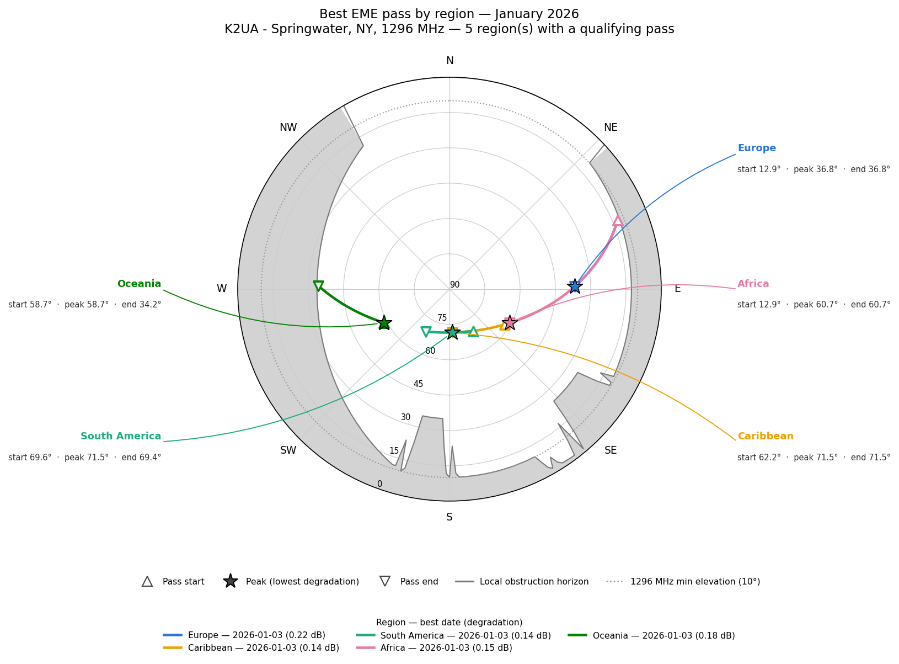

# EME Dish Siting Calculator

A comprehensive tool for calculating optimal Earth-Moon-Earth (EME) dish placement based on location, frequency band, and environmental factors.

## Overview

This calculator helps amateur radio operators determine the best location on their property for EME dish installations by analyzing:

- Moon position calculations throughout the year (via PyEphem)
- Direction-aware terrain and tree-line obstruction modeling
- Optimal azimuth ranges for target regions, gated by band-specific minimum elevation
- Wind loading considerations
- Frequency-specific RF considerations

## Features

- **Location Input**: Maidenhead grid square, lat/lon coordinates, or a full site obstruction profile (JSON)
- **Multi-band Support**: 144 MHz, 432 MHz, 902 MHz, 1296 MHz, 2304 MHz, 3456 MHz, 5760 MHz, 10 GHz+
- **Target Regions**: Europe, Caribbean, South America, Africa, Asia, Oceania
- **Direction-Aware Obstruction Modeling**: tree lines and tree clusters as measured/estimated by the operator, blended with a USGS-elevation-derived regional terrain floor (see [Methodology & Limitations](#methodology--limitations))
- **Band-Specific Minimum Elevation**: pass counting uses each band's real minimum usable elevation instead of one hardcoded value for every band
- **"What if I moved the dish" Re-runs**: re-analyze the same site with the antenna offset a given distance east/north, without re-surveying obstructions
- **Polar Az/El Plots, Monthly Best-Day Track Plots & Monthly Tables**: see [Case Study](#example-case-study-k2ua-station-fn12fr46wo)
- **Operating Schedule**: Moonrise-to-moonset operating windows
- **Web Interface**: Easy-to-use calculator with visual results
- **Serverless Deployment**: AWS Lambda-based backend

> **Note:** the Lambda/web interface (`lambda/`, `web/`) currently implements the original single-direction tree model. The direction-aware `TerrainProfile` / site-profile workflow described below is CLI-only (`src/eme_calculator.py`) as of this revision — wiring it into the Lambda handler is tracked as a follow-up, not yet done.

## Quick Start

### Web Interface
Visit the deployed calculator at: `https://your-api-gateway-url.amazonaws.com`

### Local Development
Use a virtual environment so the project's dependencies stay isolated from your system Python:
```bash
git clone https://github.com/rusk2ua/eme-dish-calculator.git
cd eme-dish-calculator

python3 -m venv venv
source venv/bin/activate      # Windows: venv\Scripts\activate

pip install -r requirements.txt
python src/eme_calculator.py --grid FN12fr46 --band 1296
```
The venv only needs creating once. Next time, just `cd` into the project and run `source venv/bin/activate` (or `venv\Scripts\activate` on Windows) again — the dependencies are already installed. Run `deactivate` when you're done. See [Virtual Environment Setup](#virtual-environment-setup) below for more detail, including why `venv/` and `.aws-sam/` never get committed.

Running that last command in a real terminal prints a short human-readable summary (annual pass counts, wind loading, RF notes) — that's the calculator running an analysis and reporting back, not a bug. See [Reading the CLI output](#reading-the-cli-output) below for the other output modes.

### Analyzing a real site with a directional obstruction profile
```bash
python src/eme_calculator.py \
  --profile data/site_profiles/k2ua_fn12fr46wo.json \
  --band 1296 --dish-diameter 2.4 --wind-speed 35 \
  --start-date 2026-01-01 --days 365
```
This prints the same kind of summary as above, computed from the real obstruction-modeled site instead of a flat-horizon grid square, plus an EME degradation figure (sky noise + Moon distance, see [Methodology & Limitations](#methodology--limitations)) computed using the site profile's `receiver_noise_figure_db` values -- override with `--noise-figure-db <dB>` if you want to try a different preamp than the one in the profile. For the full monthly-by-region breakdown and the plots, use `scripts/generate_polar_plots.py` (see the [Case Study](#example-case-study-k2ua-station-fn12fr46wo) below) rather than trying to read it out of this command's output.

### Reading the CLI output

`src/eme_calculator.py` has three output modes:

| You run it... | You get |
|---|---|
| Plainly, in a terminal (no `--output`/`--json`) | A short human-readable summary: pass counts per region, wind loading, RF notes |
| With `--output results.json` | The summary printed to the terminal **and** the full results (including the monthly-by-region breakdown) saved as JSON to that file |
| With `--json`, or piped/redirected (e.g. `... \| jq .`, `... > results.json`) | The full results as JSON on stdout, no summary |

The full JSON is what `scripts/generate_polar_plots.py` consumes internally to build the plots and `docs/monthly_conditions.md` — you don't need to read it by hand unless you're scripting against it.

Any `--output some_file.json` you save directly in the project root is gitignored (`/*.json` in `.gitignore`, anchored to the root only so it doesn't touch tracked JSON like the site profiles or the sky-noise grid) — safe to leave lying around for your own reference without it turning up in `git status`.

## Example Case Study: K2UA station, FN12fr46wo

**Location**: FN12fr46wo (42.735913°N, 77.54235°W, 479.7m / 1573.9ft ASL, from USGS EPQS)
**Band**: 1296 MHz (23cm), min. usable elevation 10°
**Dish**: 2.4m parabolic, 35mph design wind / 50mph gust rating

### The obstruction survey behind this profile

| Feature | Height | Distance | Bearing | Notes |
|---|---|---|---|---|
| West hardwood treeline | 80 ft | 120 ft | 270° (due W), N-S row | At least 800ft long; begins ~200ft north of the due-west line and runs south from there |
| East pine row | 45 ft | 200 ft | 90° (due E), ~355°-175° tilt | ~350ft long, centered on the antenna's latitude |
| SE tall pine cluster | ≥70 ft | 150 ft | 120°-140° | |
| S tall pine cluster | ≥70 ft | 100 ft | 180°-195° | |
| Far south ridge + hardwoods | 75 ft canopy + measured terrain rise | 500 ft | 150°-210° (South America window) | Overridden by the closer SE/S clusters where they overlap |

Full machine-readable profile: [`data/site_profiles/k2ua_fn12fr46wo.json`](data/site_profiles/k2ua_fn12fr46wo.json).

### Corrected annual pass counts (2026 calendar year, 1296 MHz)

| Region | Azimuth window | Annual passes | Avg. peak elevation |
|---|---|---|---|
| Europe | 30°-90° | 132 | 30.9° |
| Caribbean | 120°-180° | 365 | 45.5° |
| South America | 150°-210° | 365 | 45.5° |
| Africa | 60°-120° | 222 | 43.2° |
| Asia | 300°-360° | 0 | — |
| Oceania | 240°-300° | 162 | 51.4° |

A "pass" is now one calendar day at most, per region — see [Revision History](#revision-history) v2.0.0 for why the old numbers (240/752/499/617) were impossible, and why Caribbean/South America land at 365: at 42.7°N the Moon's daily culmination (its highest point of the day) sits roughly due south nearly every day of the year, comfortably clearing both the 10° band minimum and the local obstruction horizon in that direction almost every night it's up. Asia (300°-360°, roughly NNW-N) is essentially unreachable from this latitude — the Moon's declination range doesn't swing far enough north to rise/set in that sector in most years.

### Polar az/el plots — range of possible passes

Elevation is the radius (zenith at center, horizon at the rim); azimuth is the angle (N at top, clockwise). The gray band is the local obstruction horizon; dots are every qualifying day's peak-elevation Moon position, colored by month. The black-outlined star in each region is that month's single **best** day — lowest EME degradation (sky noise + Moon distance), not necessarily the highest dot — the same day listed in that region's row of the monthly table below.

| | |
|---|---|
|  |  |
|  |  |
|  |  |

Regenerate these with:
```bash
python scripts/generate_polar_plots.py \
  --profile data/site_profiles/k2ua_fn12fr46wo.json \
  --band 1296 --start-date 2026-01-01 --days 365 \
  --out-dir docs/plots --tables-out docs/monthly_conditions.md
```

### Monthly peak-condition az/el tables

Full tables for all six regions: [`docs/monthly_conditions.md`](docs/monthly_conditions.md). Each row is the single best (**lowest EME degradation** — sky noise + Moon distance, not simply highest elevation, see [Methodology & Limitations](#methodology--limitations)) qualifying pass that month. Two different az/el ranges are reported — see the note below the table — Caribbean excerpt (23cm, 0.25dB noise figure):

| Month | Best date | Degradation (dB) | Peak Az | Peak El | Pass Az sweep | Pass El sweep | Peak Az day-to-day spread | Peak El day-to-day spread | Qualifying days |
|---|---|---|---|---|---|---|---|---|---|
| Jan | 2026-01-03 | 0.14 | 176.5° | 71.5° | 122.7°-176.5° | 62.2°-71.5° | 172.5°-180.0° | 18.2°-75.2° | 31 |
| Jun | 2026-06-12 | 0.00 | 177.6° | 68.1° | 122.0°-177.6° | 56.3°-68.1° | 172.6°-179.8° | 18.5°-74.7° | 30 |
| Dec | 2026-12-25 | 0.00 | 178.2° | 66.8° | 122.8°-178.2° | 56.1°-66.8° | 172.9°-179.7° | 18.8°-74.5° | 31 |

**Pass Az/El sweep** is how far the Moon actually moves *during that one best day's pass* through this region's window — real tens-of-degrees movement, as you'd expect from rise to peak to set. **Peak Az/El day-to-day spread** is a different thing: how much just the peak *instant* (one point per day) drifts from one qualifying day to the next across the whole month — necessarily much narrower, since a region's peak tends to land at a similar azimuth night after night. Earlier versions of this table had a single ambiguous "Az/El range" column that was actually the day-to-day spread, which reads very oddly if you assume it's the in-pass sweep (that's ~130 degrees of azimuth typical for a full rise-to-set track, not the 5-8 degrees the old column showed) — see Revision History v2.2.0.

### Monthly best-day pass track plots — what the single best pass actually looks like

The plots above answer "what's the overall shape of the year for one region"; these answer "what does the single best pass actually look like, in real time." One chart per calendar month, every region overlaid, showing **only** that month's single lowest-degradation day's actual track — the real, connected az/el path the Moon travels from the moment it enters that region's window to the moment it leaves, not a scatter of many days. A star marks the peak (lowest-degradation) point; triangles mark the start (▲) and end (▽) of the track. Because several regions' windows genuinely overlap at this latitude (e.g. Caribbean/South America share 150°-180°) their best-day peaks often land close together on the chart, so each region's name + start/peak/end elevation labels live at a fixed position around the outside of the circle with a thin leader line back to its track, rather than floating next to the point itself — that keeps every label readable no matter how tightly the tracks cluster. January is shown below as an example:



The full set of 12 (one per month) is in [`docs/plots/monthly_tracks/`](docs/plots/monthly_tracks). Regenerate with:
```bash
python scripts/generate_monthly_track_plots.py \
  --profile data/site_profiles/k2ua_fn12fr46wo.json \
  --band 1296 --start-date 2026-01-01 --days 365 \
  --out-dir docs/plots/monthly_tracks
```
This is a separate, additive script from `generate_polar_plots.py` above — it doesn't touch or replace the annual per-region scatter plots or `docs/monthly_conditions.md`.

### Wind loading and RF

- **Wind loading**: 152.5 lbf @ 35mph design wind, 311.2 lbf @ 50mph gusts (the original case study's "112 lbf @ 35mph" didn't actually match the tool's own formula — see Revision History v2.0.0)
- **23cm antenna gain / beamwidth** (2.4m dish, 60% efficiency): 28.1 dBi / 6.7°
- **Worst-case vegetation loss**: looking through the west hardwood treeline at low elevation (80ft trees, 120ft away) costs up to 40 dB (the model's cap) at 1296 MHz — exactly why the terrain-aware pass count excludes that azimuth/elevation combination rather than trying to estimate a loss for it

### EME degradation and receiver noise figure

Every qualifying pass now also carries an EME degradation figure in dB — 0 dB is the best achievable sky-noise + Moon-distance conditions for the selected band and receiver, higher is worse — computed from where the Moon sits relative to the galactic plane/center that day and how close it is to perigee. This is what drives the "best date" pick in the tables and the star markers on the plots above; see [Methodology & Limitations](#methodology--limitations) for the model and its sourcing.

It depends on the receiver's noise figure (NF, dB, at the antenna feedpoint), which this profile sets from the operator's actual station values — 0.5dB at 144/432, 0.25dB at 1296, 0.4dB at 2304, 0.9dB at 10368 (see `receiver_noise_figure_db` in [`k2ua_fn12fr46wo.json`](data/site_profiles/k2ua_fn12fr46wo.json)). Bands not in that list (902, 3456, 5760) fall back to the generic `DEFAULT_NOISE_FIGURE_DB_BY_BAND` placeholder table in `eme_calculator.py`. Override any of these per run with `--noise-figure-db <dB>`.

### "What if" re-runs — same site, different settings

| Scenario | Europe | Caribbean | S. America | Africa | Asia | Oceania |
|---|---|---|---|---|---|---|
| 1296 MHz, dish at surveyed spot (baseline) | 132 | 365 | 365 | 222 | 0 | 162 |
| 2304 MHz (13cm), same spot — min. elevation rises to 15° | 123 | 365 | 365 | 210 | 0 | 162 |
| 1296 MHz, dish moved 100ft **west** | 136 | 365 | 365 | 226 | 0 | **0** |

Moving the dish 100ft west closes the distance to the west hardwoods from 120ft to 20ft (atan(80/20) = 76° blockage) and wipes out Oceania entirely — a good demonstration of why "just move it a bit" needs to be checked, not assumed. Reproduce these with:
```bash
python src/eme_calculator.py --profile data/site_profiles/k2ua_fn12fr46wo.json --band 2304 --start-date 2026-01-01
python src/eme_calculator.py --profile data/site_profiles/k2ua_fn12fr46wo.json --offset-east-ft -100 --start-date 2026-01-01
```

## Installation & Deployment

### Local Setup
```bash
# Clone repository
git clone https://github.com/rusk2ua/eme-dish-calculator.git
cd eme-dish-calculator

# Create and activate a virtual environment (see Virtual Environment Setup below)
python3 -m venv venv
source venv/bin/activate      # Windows: venv\Scripts\activate

# Install dependencies into the venv
pip install -r requirements.txt

# Run calculations
python src/eme_calculator.py --help
```

### Virtual Environment Setup

`requirements.txt` installs into whatever Python `pip` currently points at. Without a virtual environment, that's your system (or Homebrew) Python — fine until a second project needs a different version of the same package, or you want to blow everything away and start clean without touching anything else on the machine. A venv sidesteps that: it's a self-contained copy of Python plus whatever gets `pip install`ed into it, isolated from everything else.

```bash
# One-time setup, from the project root
python3 -m venv venv

# Every time you start working (new terminal, new session)
source venv/bin/activate      # Windows: venv\Scripts\activate
pip install -r requirements.txt   # only needed again if requirements.txt changed

# ... do your work: python src/eme_calculator.py ..., python -m pytest tests/, etc ...

# When done
deactivate
```

A `(venv)` prefix on your shell prompt means it's active. `venv/` is already in `.gitignore` — it's a local build artifact, never committed, and safe to delete and recreate (`rm -rf venv && python3 -m venv venv`) any time it gets into a weird state.

**Note on `aws-sam-cli`**: install this one globally (`pip install aws-sam-cli` outside any venv, or `brew install aws-sam-cli` on macOS) rather than inside this project's venv. It's a general-purpose CLI you'll want on your `PATH` across every AWS project, not a dependency of this one — installing it into a per-project venv means `sam` only works while that venv happens to be active, which gets confusing fast.

### AWS Deployment
```bash
# Build and deploy (sam CLI installed globally -- see note above)
sam build
sam deploy --guided
```

## API Usage

### Calculate EME Windows
```bash
curl -X POST https://your-api.amazonaws.com/calculate \
  -H "Content-Type: application/json" \
  -d '{
    "grid_square": "FN12fr46",
    "frequency_mhz": 1296,
    "dish_diameter_m": 2.4,
    "tree_height_ft": 80,
    "tree_distance_ft": 100,
    "max_wind_mph": 50,
    "target_regions": ["Europe", "Caribbean"]
  }'
```

### Response Format
```json
{
  "location": {
    "grid_square": "FN12fr46",
    "latitude": 42.733333,
    "longitude": -77.550000,
    "elevation_m": 500
  },
  "recommendations": {
    "optimal_location": "150-200 feet east of house",
    "azimuth_range": "30°-210°",
    "foundation_requirements": "Reinforced concrete for 400+ lbf"
  },
  "eme_windows": {
    "Europe": {
      "annual_passes": 132,
      "avg_hours_after_moonrise": 2.7
    }
  },
  "rf_considerations": {
    "frequency_mhz": 1296,
    "wavelength_cm": 23.1,
    "tree_loss_db": 15.2,
    "rain_fade_db": 2.1
  }
}
```
> This response shape is illustrative of the web/Lambda API, which (see the note under Features) has not yet been updated to the corrected pass-counting/terrain model — the CLI is authoritative as of this revision.

## Frequency Band Considerations

| Band | Frequency | Wavelength | Tree Sensitivity | Rain Fade |
|------|-----------|------------|------------------|-----------|
| 2m   | 144 MHz   | 208 cm     | Low              | Minimal   |
| 70cm | 432 MHz   | 69 cm      | Medium           | Low       |
| 33cm | 902 MHz   | 33 cm      | Medium           | Medium    |
| 23cm | 1296 MHz  | 23 cm      | High             | Medium    |
| 13cm | 2304 MHz  | 13 cm      | Very High        | High      |
| 9cm  | 3456 MHz  | 9 cm       | Extreme          | High      |
| 6cm  | 5760 MHz  | 5 cm       | Extreme          | Very High |
| 3cm  | 10 GHz    | 3 cm       | Extreme          | Very High |

## Methodology & Limitations

**Pass counting.** For every day in the analysis window, the Moon's track from moonrise to moonset is sampled every 10 minutes. A sample counts as "usable" for a region if its azimuth falls in that region's window AND its elevation clears both the band's minimum usable elevation (`RFAnalyzer.BAND_CHARACTERISTICS[band]['min_elevation_deg']`) and the local obstruction horizon at that azimuth. Each day contributes at most one pass per region — the highest-elevation usable sample that day.

**Two different "az/el range" figures, not one** (as of v2.2.0): `pass_azimuth_sweep_deg`/`pass_elevation_sweep_deg` is the min/max across every usable sample on the best day specifically — how far the Moon actually moves while it's inside a region's window that day, typically tens of degrees. `peak_azimuth_spread_deg`/`peak_elevation_spread_deg` is a different, much narrower thing: the min/max of just the single peak-elevation instant, one point per qualifying day, across every qualifying day in the month — how much that one moment drifts night to night, not how far any single pass sweeps. An earlier version reported only the day-to-day figure under the ambiguous name "azimuth range," which reads as the in-pass sweep and is off by an order of magnitude from it.

**Terrain/obstruction horizon** (`src/terrain.py`) combines two things: (1) explicit near-field features — tree lines modeled as finite line segments and tree clusters modeled as azimuth arcs, both with a 3° edge taper — and (2) a coarse regional "terrain floor" from 9 USGS National Map Elevation Point Query Service (EPQS) samples (site center + 8 compass octants at 2000ft range), piecewise-linearly interpolated by azimuth. The near-field features dominate almost everywhere that matters for this site, since a public DEM's 2000ft sample spacing cannot resolve individual tree lines.

**What this is not**: a dense ray-marched horizon profile. A proper one would sample terrain every few meters out to 20-30km on every azimuth. That wasn't feasible from this development environment's network sandbox (only a handful of allowlisted domains are reachable; general internet and the usual DEM tile/API hosts are not) — `fetch_octant_samples()` and `fetch_elevation_ft()` in `terrain.py` are real, working USGS EPQS client code that will run at full resolution wherever this is executed with normal internet access. If you want denser coverage, swap in [py3dep](https://github.com/hyriver/py3dep) (USGS 3DEP, 1-10m resolution over the US), `elevation`/`srtm.py` (SRTM 30-90m, global), or [AWS Terrain Tiles](https://registry.opendata.aws/terrain-tiles/) (public S3, Terrarium-encoded PNG DEM) — see the module docstring.

**West treeline extent**: originally modeled as an assumed 300ft-each-way symmetric row (unmeasured placeholder); corrected per the operator's field estimate to an asymmetric run — at least 800ft long, starting ~200ft north of the due-west line and extending south from there (`along_line_start_ft`/`along_line_end_ft` in the profile, rather than a symmetric `half_length_ft`). This changed the shape of the obstruction wedge in the polar plots (compare the west/southwest edge to earlier renders) but did not flip any day's pass/no-pass outcome for the current six regions — the azimuths where the two models disagree (150°-200° and 300°-330°) aren't where any region's daily peak sample lands. The row may run further south than the confirmed 800ft; if so, obstruction is understated for the southernmost few degrees of its span. Edit `along_line_start_ft` in the profile if a longer confirmed extent becomes available.

**Tree heights and distances** are field estimates (±10ft on distance, ±5ft on height per the profile's own notes), not a survey. `calculate_tree_blockage()` and the single-direction `calculate_rf_considerations()` tree-loss estimate in `eme_calculator.py` are retained for backward compatibility but only model one direction — prefer a `TerrainProfile` for anything direction-dependent, which is essentially everything in EME siting.

**EME degradation model** (`src/sky_noise.py`) ranks each month's "best day" by lowest degradation instead of highest elevation, as of v2.1.0. It combines two terms into one dB figure, 0 = best achievable for the selected band/receiver:

- **Sky (galactic) noise**: the diffuse galactic radio background varies hugely with where in the sky the Moon is (cold off the galactic plane, much hotter toward the galactic center/Cygnus X) and falls off steeply with frequency (dominant at 144MHz, down to a few K above the cosmic microwave background by 1296MHz and up). A real pixel-accurate map means the `pygdsm` package — healpy, h5py, astropy, scipy, plus a ~500MB one-time data download — which was evaluated and declined as disproportionate to this project's footprint. Instead, `data/sky_noise/galactic_408mhz_grid.json` is a **synthesized analytic approximation** on a coarse 15°×15° galactic-coordinate grid, calibrated to published landmark magnitudes (Haslam et al. 1982; off-plane floor ≈15-20K, galactic-plane general enhancement to the ~100-200K range, inner-galaxy enhancement to the low thousands of K within a 15° beam-averaged cell) — **not digitized survey pixels**. Frequency scaling uses ITU-R P.372-12 eq (15): `Tb(f) = Tb(408MHz)*(f/408)^-2.75 + 2.7K`. Swapping in `pygdsm` or real digitized survey values later is a drop-in upgrade to that one file; nothing else would need to change. Full derivation and citations are in the `src/sky_noise.py` module docstring.
- **Lunar distance (range factor)**: two-way (round-trip, R⁴) free-space path loss relative to a fixed perigee reference (356,500 km), which works out to ≈2.3 dB max at apogee — computed from `ephem`'s actual Moon-Earth distance for each sample, not a lookup table.
- **Receiver noise figure**: from the site profile's `receiver_noise_figure_db` (per-band, at the antenna feedpoint) or `--noise-figure-db`, converted to noise temperature via the standard `Te = 290*(10^(NF_dB/10)-1)` relationship.

This model started from a methodology summary the user supplied (paraphrased from WSJT-X/EME community practice). Two things in that summary didn't hold up against the references above and are corrected here — both explained in detail in the `sky_noise.py` docstring: the formula's sign was backwards (degradation went negative for worse conditions, contradicting its own "0dB=best, higher=worse" description), and the quoted 12-14dB apogee-to-perigee range is actually the sky-noise term's typical swing (real at 144MHz) misattributed to the much smaller (~2.3dB) distance term.

**What the degradation model is not**: an atmospheric/rain-attenuation or elevation-dependent-loss model (those are handled separately by `rf_considerations`' rain-fade estimate and the terrain horizon cutoff), or pixel-accurate galactic noise mapping (see above). The K2UA profile's receiver noise figures are the operator's real station values as of v2.1.1 — see [EME degradation and receiver noise figure](#eme-degradation-and-receiver-noise-figure) — but a band you add to a profile without supplying its own NF still falls back to the generic `DEFAULT_NOISE_FIGURE_DB_BY_BAND` placeholder table.

## Rerunning for Other Scenarios

Every number in this README is reproducible from the CLI — no code changes needed for a new band, dish size, or antenna position:

```bash
# Different band, same site
python src/eme_calculator.py --profile data/site_profiles/k2ua_fn12fr46wo.json --band 432

# Move the antenna (feet east/north of the profile's surveyed location)
python src/eme_calculator.py --profile data/site_profiles/k2ua_fn12fr46wo.json \
  --offset-east-ft 50 --offset-north-ft -20

# Regenerate the polar plots + monthly tables for a scenario
python scripts/generate_polar_plots.py --profile data/site_profiles/k2ua_fn12fr46wo.json \
  --band 902 --offset-east-ft -100 --out-dir docs/plots_902_west100

# Regenerate the monthly best-day pass track plots for a scenario
python scripts/generate_monthly_track_plots.py --profile data/site_profiles/k2ua_fn12fr46wo.json \
  --band 902 --offset-east-ft -100 --out-dir docs/plots_902_west100/monthly_tracks
```

To model a different site, copy `data/site_profiles/k2ua_fn12fr46wo.json` and edit the coordinates, `elevation_ft`, and the obstruction lists — or fall back to `--grid` + `--tree-height`/`--tree-distance` for a quick single-direction estimate without a full profile.

## Contributing

1. Fork the repository
2. Create a feature branch (`git checkout -b feature/amazing-feature`)
3. Commit your changes (`git commit -m 'Add amazing feature'`)
4. Push to the branch (`git push origin feature/amazing-feature`)
5. Open a Pull Request

## License

This project is licensed under the MIT License - see the [LICENSE](LICENSE) file for details.

## Revision History

| Version | Date | Changes |
|---|---|---|
| 1.0.0 | 2025-10-29 | Initial commit: EME dish siting calculator with 902 MHz and 10 GHz support |
| 1.1.0 | 2025-10-29 | Documentation updated with K2UA callsign |
| 1.1.1 | 2025-10-29 | README revision |
| 1.2.0 | 2025-10-29 | Added support for 6, 8, and 10-digit Maidenhead grid squares |
| 1.2.1 | 2026-08-18 | README revision |
| 1.2.2 | 2026-08-18 | README revision |
| **2.0.0** | **2026-08-20** | **Major revision.** Fixed a bug where `analyze_eme_opportunities()` counted every hourly sample within a region's azimuth window as a separate "pass," instead of one pass per calendar day — this let annual pass counts exceed 365 (physically impossible, the Moon rises once/day), which is what produced the case study's impossible 752 Caribbean / 499 South America / 617 Africa passes/year. Added `src/terrain.py`: direction-aware obstruction modeling combining operator-surveyed tree lines/clusters with a USGS EPQS-derived regional terrain floor, plus antenna-offset support for "what if I moved the dish" re-runs. Unified the minimum-usable-elevation threshold between `eme_calculator.py` and `rf_analysis.py` (previously two different hardcoded values, 10° flat vs. band-specific 5°-30°). Replaced the fictional FN12fr46 case study with the real K2UA station (FN12fr46wo), a full obstruction survey, USGS-sourced elevation, and corrected pass counts. Added polar az/el plots (`scripts/generate_polar_plots.py`, `docs/plots/`) and monthly peak-condition az/el tables (`docs/monthly_conditions.md`). Added `--start-date` for reproducible analysis windows. Added this Methodology & Limitations section and this Revision History. |
| 2.0.1 | 2026-08-20 | Corrected the west hardwood treeline's modeled extent from a placeholder symmetric 300ft-each-way assumption to the operator's field estimate: an asymmetric row at least 800ft long, starting ~200ft north of the due-west line and running south. Added `along_line_start_ft`/`along_line_end_ft` support to `terrain.py` for asymmetric rows (kept `half_length_ft` working for symmetric ones, e.g. the east pine row). No region's annual pass count changed — see Methodology & Limitations. |
| 2.0.2 | 2026-08-20 | Documentation only: local setup instructions (README Quick Start/Local Setup, DEPLOYMENT.md, PROJECT_STRUCTURE.md) now create and activate a Python virtual environment before `pip install`, instead of installing onto the system/Homebrew Python. Added a "Virtual Environment Setup" section to README.md. |
| 2.0.3 | 2026-08-21 | `src/eme_calculator.py`'s CLI printed a large raw JSON dump to the terminal with no explanation of what it was, which read as broken rather than working as intended. Added `format_summary()` and made it the default terminal output (pass counts, wind loading, RF notes); the full JSON is now opt-in via `--json`, via `--output <file>` (which also still prints the summary), or automatically when stdout is piped/redirected rather than an interactive terminal. See [Reading the CLI Output](#reading-the-cli-output). |
| **2.1.0** | **2026-08-21** | **EME degradation model.** Added `src/sky_noise.py`: sky (galactic) noise + lunar-distance path loss combined into a single dB degradation figure per pass (0dB = best achievable for the band/receiver). `monthly_conditions()` now ranks each month's "best day" by lowest degradation instead of highest peak elevation. Added `receiver_noise_figure_db` (per-band, at the antenna feedpoint) to the site profile schema, with a `--noise-figure-db` CLI override and generic per-band fallback defaults; seeded the K2UA profile with placeholder values pending real measurements. Corrected two errors found in the user-supplied source methodology during research (see Methodology & Limitations): a backwards degradation sign, and a 12-14dB apogee-to-perigee range-factor figure that was actually sky-noise swing misattributed to the (~2.3dB) distance term. Sky noise uses a synthesized, dependency-free analytic approximation of the galactic 408MHz background (`data/sky_noise/galactic_408mhz_grid.json`) rather than the `pygdsm` package, after evaluating and declining its ~500MB data download and heavy dependency chain (healpy/h5py/astropy/scipy) as disproportionate to this project. Polar plots now star each month's best-degradation day; monthly tables gained a Degradation (dB) column. No new dependencies. |
| 2.1.1 | 2026-08-21 | Replaced the v2.1.0 placeholder receiver noise figures in the K2UA profile with the operator's real station values: 0.5dB at 144/432 MHz, 0.25dB at 1296 MHz, 0.4dB at 2304 MHz, 0.9dB at 10368 MHz. Fixed a display rounding issue where 0.25dB printed as "0.2 dB" (Python's `.1f` uses round-half-to-even); noise-figure display now uses two decimal places throughout. Regenerated the case study's plots, `docs/monthly_conditions.md`, and README excerpt with the real values — degradation figures shifted slightly (e.g. Caribbean's avg. degradation 1.5dB→1.7dB at 1296 MHz); no region's annual pass count or any month's best-date pick changed. |
| **2.2.0** | **2026-08-21** | **Split the ambiguous "azimuth/elevation range" into two correctly-named, independently-computed fields.** The old `month_azimuth_range_deg`/`month_elevation_range_deg` was only ever the day-to-day spread of each day's single peak-elevation instant (typically 5-8° of azimuth) — read naturally, that name implies the full moonrise-to-moonset sweep during one pass, which is routinely 100°+ and is a completely different number. `analyze_eme_opportunities()` now tracks the min/max azimuth and elevation across every usable sample on each day (not just the peak), so `monthly_conditions()` can report both: `pass_azimuth_sweep_deg`/`pass_elevation_sweep_deg` (how far the Moon moves during the best day's actual pass through the region window — tens of degrees) and `peak_azimuth_spread_deg`/`peak_elevation_spread_deg` (the renamed day-to-day figure, unchanged in meaning). `docs/monthly_conditions.md` and the README excerpt gained two columns accordingly. No pass counts, degradation values, or best-day picks changed — this is a reporting-detail addition and rename, not a recalculation. Also fixed a stale Methodology & Limitations sentence still describing the K2UA profile's noise figures as placeholders after v2.1.1 replaced them with real values. Added 1 new test (18 total, all passing). |
| 2.2.1 | 2026-08-21 | Added `/*.json` to `.gitignore`, anchored to the project root only (leading slash, no directory wildcard) so it catches stray `--output` result dumps left in the repo root without touching tracked JSON that belongs in the repo (`data/site_profiles/*.json`, `data/sky_noise/*.json`). Prompted by a real `--output` file accidentally getting swept into the v2.2.0 commit via `git add -A`, caught and removed before push. Documented in [Reading the CLI Output](#reading-the-cli-output). |
| **2.3.0** | **2026-08-21** | **Monthly best-day pass track plots.** Added `scripts/generate_monthly_track_plots.py` and `src/eme_calculator.py`'s new `get_pass_track_for_date()` (the ordered, time-sequenced counterpart to `pass_azimuth_sweep_deg`/`pass_elevation_sweep_deg` — the actual sample-by-sample path, not just its min/max). Produces one polar plot per calendar month, all six regions overlaid, showing only that month's single lowest-degradation day's real track as a connected line with the start (▲), peak (★), and end (▽) marked and elevation-labeled — a separate, additive view alongside the existing annual per-region scatter plots (`docs/plots/monthly_tracks/`, `docs/plots/` unchanged). Because several regions' azimuth windows genuinely overlap at this latitude (Caribbean/South America share 150°-180°, Europe/Africa share 60°-90°), their best-day peaks often land close together on the chart; rather than offsetting each label a fixed distance from its own point (which still collided when two regions' points sit next to each other), every region's name + start/peak/end elevation label lives at a fixed position around the outside of the circle with a thin leader line back to its track, so labels never collide regardless of how tightly the underlying tracks cluster. Palette (6-color categorical, validated with the project's dataviz-skill `validate_palette.js` under the strict "all pairs" mode) and marker shapes are shared with no color-alone identity. Added 2 new tests (20 total, all passing). No new dependencies (matplotlib/numpy already required). |

## Acknowledgments

- PyEphem library for astronomical calculations
- USGS National Map Elevation Point Query Service for site and regional terrain elevation data
- Amateur radio EME community for operational insights
- AWS for serverless infrastructure

## Support

- Create an issue for bug reports or feature requests
- Join the discussion in the amateur radio EME forums

---

**73 de K2UA**
