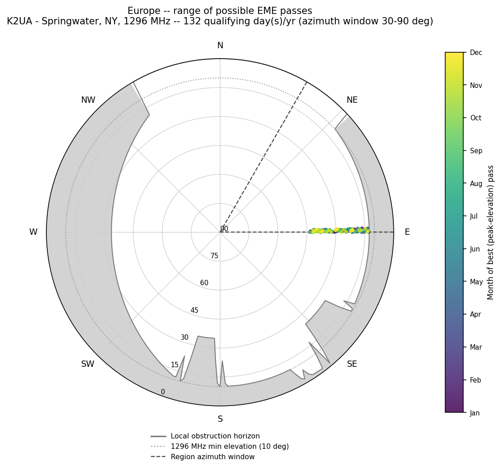
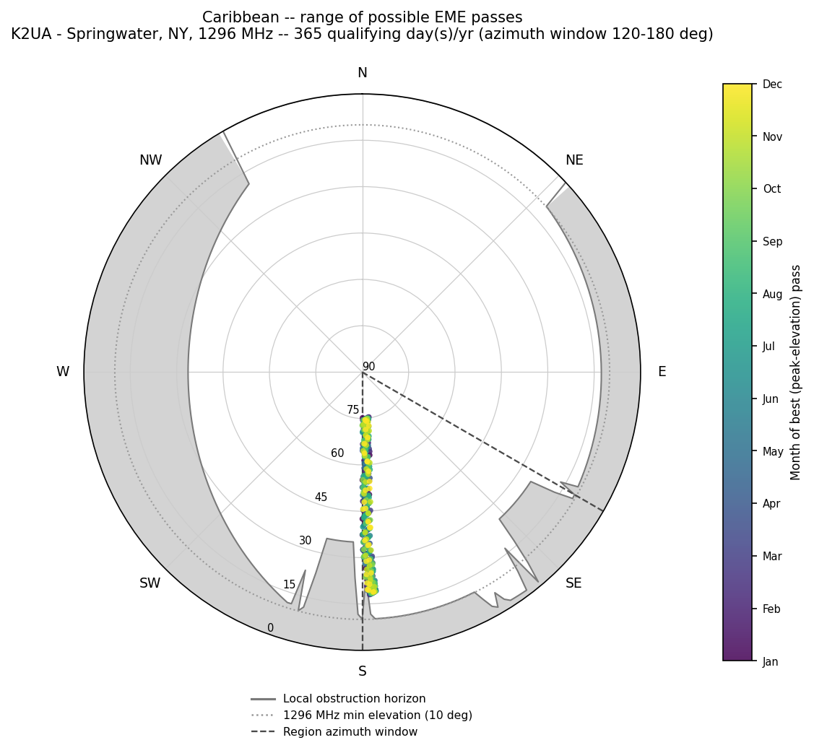
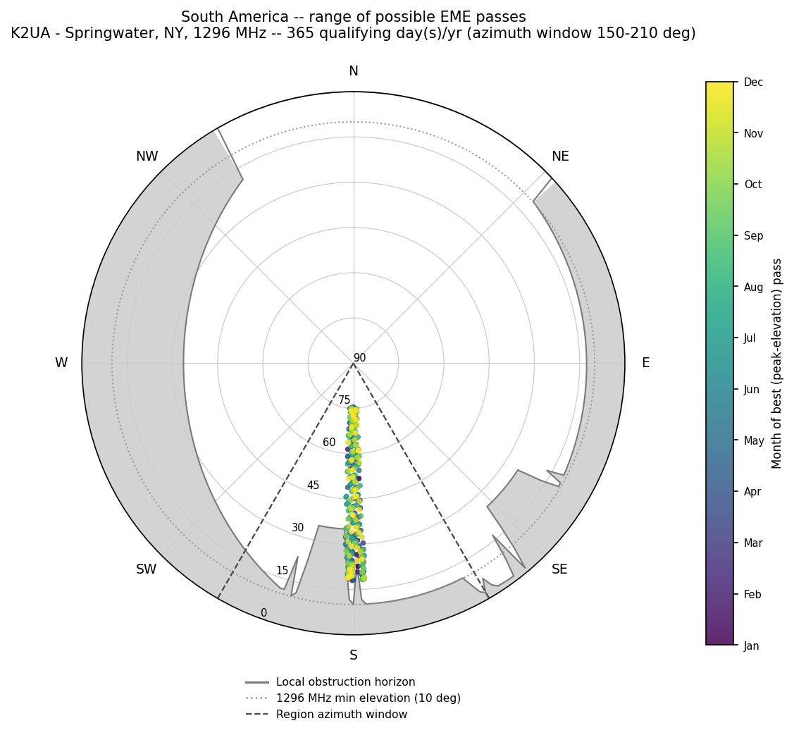
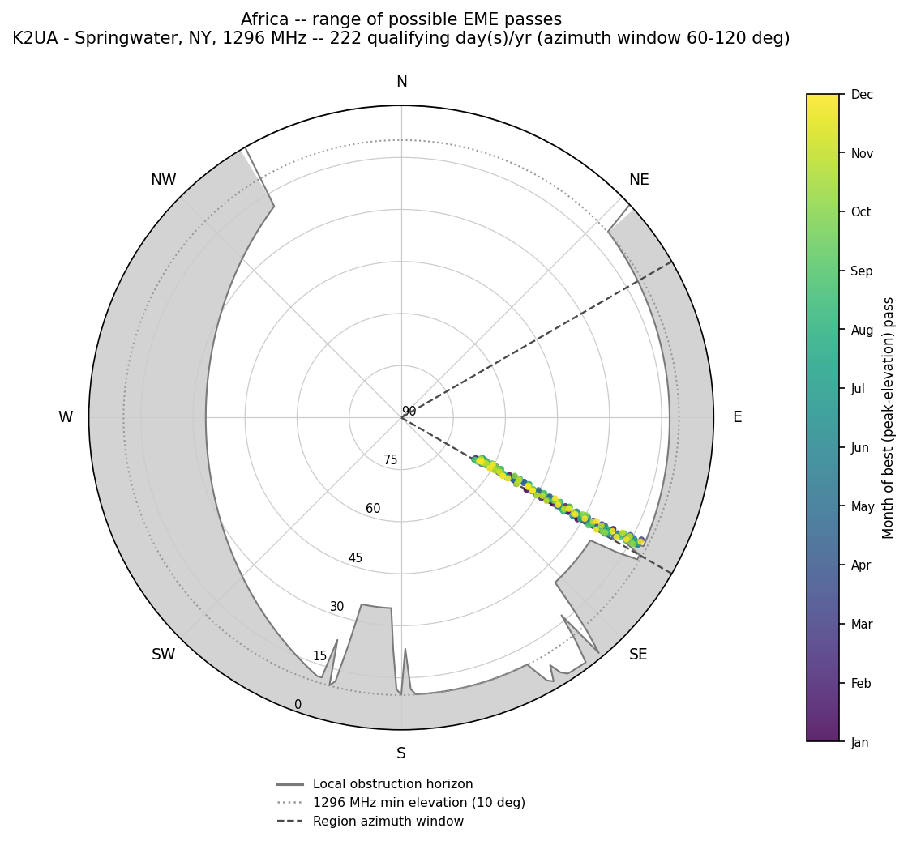
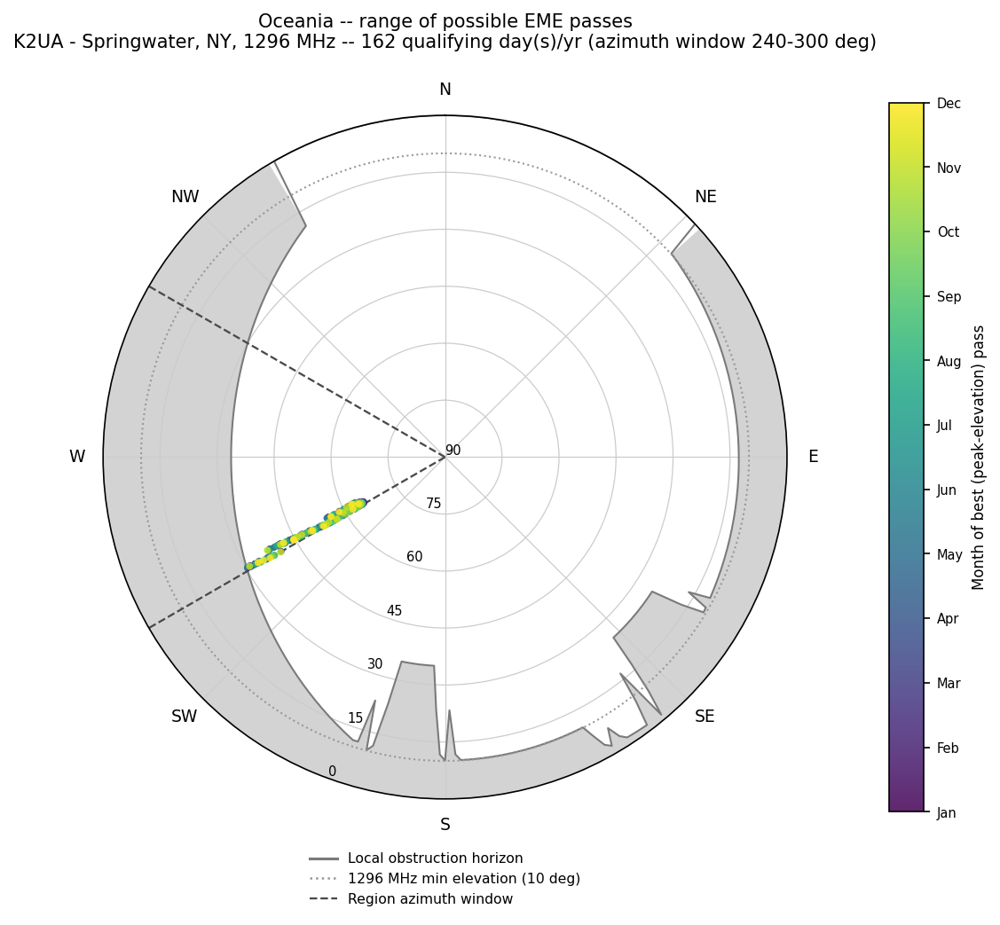
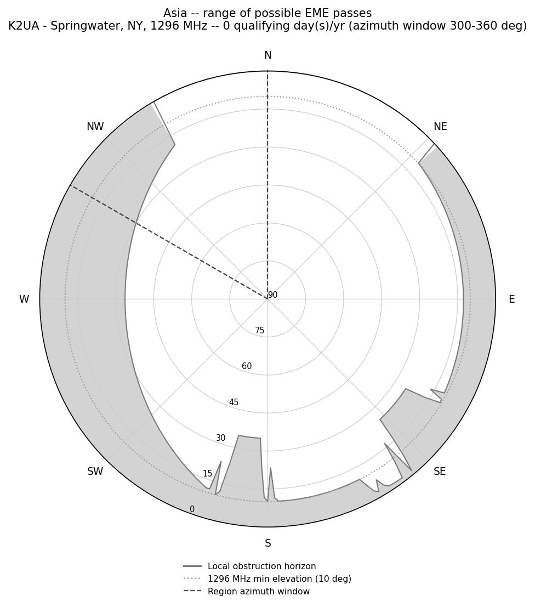

# EME Dish Siting Calculator

A comprehensive tool for calculating optimal Earth-Moon-Earth (EME) dish placement based on location, frequency band, and environmental factors.

## Overview

This calculator helps amateur radio operators determine the best location on their property for EME dish installations by analyzing:

- Moon position calculations throughout the year (via PyEphem)
- Direction-aware terrain and tree-line obstruction modeling
- Optimal azimuth ranges for target regions, gated by band-specific minimum elevation
- Wind loading considerations
- Frequency-specific RF considerations

## Features

- **Location Input**: Maidenhead grid square, lat/lon coordinates, or a full site obstruction profile (JSON)
- **Multi-band Support**: 144 MHz, 432 MHz, 902 MHz, 1296 MHz, 2304 MHz, 3456 MHz, 5760 MHz, 10 GHz+
- **Target Regions**: Europe, Caribbean, South America, Africa, Asia, Oceania
- **Direction-Aware Obstruction Modeling**: tree lines and tree clusters as measured/estimated by the operator, blended with a USGS-elevation-derived regional terrain floor (see [Methodology & Limitations](#methodology--limitations))
- **Band-Specific Minimum Elevation**: pass counting uses each band's real minimum usable elevation instead of one hardcoded value for every band
- **"What if I moved the dish" Re-runs**: re-analyze the same site with the antenna offset a given distance east/north, without re-surveying obstructions
- **Polar Az/El Plots & Monthly Tables**: see [Case Study](#example-case-study-k2ua-station-fn12fr46wo)
- **Operating Schedule**: Moonrise-to-moonset operating windows
- **Web Interface**: Easy-to-use calculator with visual results
- **Serverless Deployment**: AWS Lambda-based backend

> **Note:** the Lambda/web interface (`lambda/`, `web/`) currently implements the original single-direction tree model. The direction-aware `TerrainProfile` / site-profile workflow described below is CLI-only (`src/eme_calculator.py`) as of this revision — wiring it into the Lambda handler is tracked as a follow-up, not yet done.

## Quick Start

### Web Interface
Visit the deployed calculator at: `https://your-api-gateway-url.amazonaws.com`

### Local Development
```bash
git clone https://github.com/rusk2ua/eme-dish-calculator.git
cd eme-dish-calculator
pip install -r requirements.txt
python src/eme_calculator.py --grid FN12fr46 --band 1296
```

### Analyzing a real site with a directional obstruction profile
```bash
python src/eme_calculator.py \
  --profile data/site_profiles/k2ua_fn12fr46wo.json \
  --band 1296 --dish-diameter 2.4 --wind-speed 35 \
  --start-date 2026-01-01 --days 365
```

## Example Case Study: K2UA station, FN12fr46wo

**Location**: FN12fr46wo (42.735913°N, 77.54235°W, 479.7m / 1573.9ft ASL, from USGS EPQS)
**Band**: 1296 MHz (23cm), min. usable elevation 10°
**Dish**: 2.4m parabolic, 35mph design wind / 50mph gust rating

### The obstruction survey behind this profile

| Feature | Height | Distance | Bearing | Notes |
|---|---|---|---|---|
| West hardwood treeline | 80 ft | 120 ft | 270° (due W), N-S row | At least 800ft long; begins ~200ft north of the due-west line and runs south from there |
| East pine row | 45 ft | 200 ft | 90° (due E), ~355°-175° tilt | ~350ft long, centered on the antenna's latitude |
| SE tall pine cluster | ≥70 ft | 150 ft | 120°-140° | |
| S tall pine cluster | ≥70 ft | 100 ft | 180°-195° | |
| Far south ridge + hardwoods | 75 ft canopy + measured terrain rise | 500 ft | 150°-210° (South America window) | Overridden by the closer SE/S clusters where they overlap |

Full machine-readable profile: [`data/site_profiles/k2ua_fn12fr46wo.json`](data/site_profiles/k2ua_fn12fr46wo.json).

### Corrected annual pass counts (2026 calendar year, 1296 MHz)

| Region | Azimuth window | Annual passes | Avg. peak elevation |
|---|---|---|---|
| Europe | 30°-90° | 132 | 30.9° |
| Caribbean | 120°-180° | 365 | 45.5° |
| South America | 150°-210° | 365 | 45.5° |
| Africa | 60°-120° | 222 | 43.2° |
| Asia | 300°-360° | 0 | — |
| Oceania | 240°-300° | 162 | 51.4° |

A "pass" is now one calendar day at most, per region — see [Revision History](#revision-history) v2.0.0 for why the old numbers (240/752/499/617) were impossible, and why Caribbean/South America land at 365: at 42.7°N the Moon's daily culmination (its highest point of the day) sits roughly due south nearly every day of the year, comfortably clearing both the 10° band minimum and the local obstruction horizon in that direction almost every night it's up. Asia (300°-360°, roughly NNW-N) is essentially unreachable from this latitude — the Moon's declination range doesn't swing far enough north to rise/set in that sector in most years.

### Polar az/el plots — range of possible passes

Elevation is the radius (zenith at center, horizon at the rim); azimuth is the angle (N at top, clockwise). The gray band is the local obstruction horizon; dots are every qualifying day's peak-elevation Moon position, colored by month.

| | |
|---|---|
|  |  |
|  |  |
|  |  |

Regenerate these with:
```bash
python scripts/generate_polar_plots.py \
  --profile data/site_profiles/k2ua_fn12fr46wo.json \
  --band 1296 --start-date 2026-01-01 --days 365 \
  --out-dir docs/plots --tables-out docs/monthly_conditions.md
```

### Monthly peak-condition az/el tables

Full tables for all six regions: [`docs/monthly_conditions.md`](docs/monthly_conditions.md). Each row is the single best (highest peak-elevation — least atmospheric-absorption and obstruction degradation) qualifying pass that month, plus the azimuth/elevation range covered by every qualifying pass in that month. Caribbean excerpt:

| Month | Best date | Peak Az | Peak El | Az range | El range | Qualifying days |
|---|---|---|---|---|---|---|
| Jan | 2026-01-19 | 174.4° | 74.6° | 173.2°-179.5° | 18.8°-74.6° | 31 |
| Jun | 2026-06-05 | 176.9° | 74.0° | 174.1°-179.9° | 19.4°-74.0° | 30 |
| Dec | 2026-12-22 | 176.6° | 74.5° | 172.9°-179.7° | 18.8°-74.5° | 31 |

### Wind loading and RF

- **Wind loading**: 152.5 lbf @ 35mph design wind, 311.2 lbf @ 50mph gusts (the original case study's "112 lbf @ 35mph" didn't actually match the tool's own formula — see Revision History v2.0.0)
- **23cm antenna gain / beamwidth** (2.4m dish, 60% efficiency): 28.1 dBi / 6.7°
- **Worst-case vegetation loss**: looking through the west hardwood treeline at low elevation (80ft trees, 120ft away) costs up to 40 dB (the model's cap) at 1296 MHz — exactly why the terrain-aware pass count excludes that azimuth/elevation combination rather than trying to estimate a loss for it

### "What if" re-runs — same site, different settings

| Scenario | Europe | Caribbean | S. America | Africa | Asia | Oceania |
|---|---|---|---|---|---|---|
| 1296 MHz, dish at surveyed spot (baseline) | 132 | 365 | 365 | 222 | 0 | 162 |
| 2304 MHz (13cm), same spot — min. elevation rises to 15° | 123 | 365 | 365 | 210 | 0 | 162 |
| 1296 MHz, dish moved 100ft **west** | 136 | 365 | 365 | 226 | 0 | **0** |

Moving the dish 100ft west closes the distance to the west hardwoods from 120ft to 20ft (atan(80/20) = 76° blockage) and wipes out Oceania entirely — a good demonstration of why "just move it a bit" needs to be checked, not assumed. Reproduce these with:
```bash
python src/eme_calculator.py --profile data/site_profiles/k2ua_fn12fr46wo.json --band 2304 --start-date 2026-01-01
python src/eme_calculator.py --profile data/site_profiles/k2ua_fn12fr46wo.json --offset-east-ft -100 --start-date 2026-01-01
```

## Installation & Deployment

### Local Setup
```bash
# Clone repository
git clone https://github.com/rusk2ua/eme-dish-calculator.git
cd eme-dish-calculator

# Install dependencies
pip install -r requirements.txt

# Run calculations
python src/eme_calculator.py --help
```

### AWS Deployment
```bash
# Install AWS SAM CLI
pip install aws-sam-cli

# Build and deploy
sam build
sam deploy --guided
```

## API Usage

### Calculate EME Windows
```bash
curl -X POST https://your-api.amazonaws.com/calculate \
  -H "Content-Type: application/json" \
  -d '{
    "grid_square": "FN12fr46",
    "frequency_mhz": 1296,
    "dish_diameter_m": 2.4,
    "tree_height_ft": 80,
    "tree_distance_ft": 100,
    "max_wind_mph": 50,
    "target_regions": ["Europe", "Caribbean"]
  }'
```

### Response Format
```json
{
  "location": {
    "grid_square": "FN12fr46",
    "latitude": 42.733333,
    "longitude": -77.550000,
    "elevation_m": 500
  },
  "recommendations": {
    "optimal_location": "150-200 feet east of house",
    "azimuth_range": "30°-210°",
    "foundation_requirements": "Reinforced concrete for 400+ lbf"
  },
  "eme_windows": {
    "Europe": {
      "annual_passes": 132,
      "avg_hours_after_moonrise": 2.7
    }
  },
  "rf_considerations": {
    "frequency_mhz": 1296,
    "wavelength_cm": 23.1,
    "tree_loss_db": 15.2,
    "rain_fade_db": 2.1
  }
}
```
> This response shape is illustrative of the web/Lambda API, which (see the note under Features) has not yet been updated to the corrected pass-counting/terrain model — the CLI is authoritative as of this revision.

## Frequency Band Considerations

| Band | Frequency | Wavelength | Tree Sensitivity | Rain Fade |
|------|-----------|------------|------------------|-----------|
| 2m   | 144 MHz   | 208 cm     | Low              | Minimal   |
| 70cm | 432 MHz   | 69 cm      | Medium           | Low       |
| 33cm | 902 MHz   | 33 cm      | Medium           | Medium    |
| 23cm | 1296 MHz  | 23 cm      | High             | Medium    |
| 13cm | 2304 MHz  | 13 cm      | Very High        | High      |
| 9cm  | 3456 MHz  | 9 cm       | Extreme          | High      |
| 6cm  | 5760 MHz  | 5 cm       | Extreme          | Very High |
| 3cm  | 10 GHz    | 3 cm       | Extreme          | Very High |

## Methodology & Limitations

**Pass counting.** For every day in the analysis window, the Moon's track from moonrise to moonset is sampled every 10 minutes. A sample counts as "usable" for a region if its azimuth falls in that region's window AND its elevation clears both the band's minimum usable elevation (`RFAnalyzer.BAND_CHARACTERISTICS[band]['min_elevation_deg']`) and the local obstruction horizon at that azimuth. Each day contributes at most one pass per region — the highest-elevation usable sample that day.

**Terrain/obstruction horizon** (`src/terrain.py`) combines two things: (1) explicit near-field features — tree lines modeled as finite line segments and tree clusters modeled as azimuth arcs, both with a 3° edge taper — and (2) a coarse regional "terrain floor" from 9 USGS National Map Elevation Point Query Service (EPQS) samples (site center + 8 compass octants at 2000ft range), piecewise-linearly interpolated by azimuth. The near-field features dominate almost everywhere that matters for this site, since a public DEM's 2000ft sample spacing cannot resolve individual tree lines.

**What this is not**: a dense ray-marched horizon profile. A proper one would sample terrain every few meters out to 20-30km on every azimuth. That wasn't feasible from this development environment's network sandbox (only a handful of allowlisted domains are reachable; general internet and the usual DEM tile/API hosts are not) — `fetch_octant_samples()` and `fetch_elevation_ft()` in `terrain.py` are real, working USGS EPQS client code that will run at full resolution wherever this is executed with normal internet access. If you want denser coverage, swap in [py3dep](https://github.com/hyriver/py3dep) (USGS 3DEP, 1-10m resolution over the US), `elevation`/`srtm.py` (SRTM 30-90m, global), or [AWS Terrain Tiles](https://registry.opendata.aws/terrain-tiles/) (public S3, Terrarium-encoded PNG DEM) — see the module docstring.

**West treeline extent**: originally modeled as an assumed 300ft-each-way symmetric row (unmeasured placeholder); corrected per the operator's field estimate to an asymmetric run — at least 800ft long, starting ~200ft north of the due-west line and extending south from there (`along_line_start_ft`/`along_line_end_ft` in the profile, rather than a symmetric `half_length_ft`). This changed the shape of the obstruction wedge in the polar plots (compare the west/southwest edge to earlier renders) but did not flip any day's pass/no-pass outcome for the current six regions — the azimuths where the two models disagree (150°-200° and 300°-330°) aren't where any region's daily peak sample lands. The row may run further south than the confirmed 800ft; if so, obstruction is understated for the southernmost few degrees of its span. Edit `along_line_start_ft` in the profile if a longer confirmed extent becomes available.

**Tree heights and distances** are field estimates (±10ft on distance, ±5ft on height per the profile's own notes), not a survey. `calculate_tree_blockage()` and the single-direction `calculate_rf_considerations()` tree-loss estimate in `eme_calculator.py` are retained for backward compatibility but only model one direction — prefer a `TerrainProfile` for anything direction-dependent, which is essentially everything in EME siting.

## Rerunning for Other Scenarios

Every number in this README is reproducible from the CLI — no code changes needed for a new band, dish size, or antenna position:

```bash
# Different band, same site
python src/eme_calculator.py --profile data/site_profiles/k2ua_fn12fr46wo.json --band 432

# Move the antenna (feet east/north of the profile's surveyed location)
python src/eme_calculator.py --profile data/site_profiles/k2ua_fn12fr46wo.json \
  --offset-east-ft 50 --offset-north-ft -20

# Regenerate the polar plots + monthly tables for a scenario
python scripts/generate_polar_plots.py --profile data/site_profiles/k2ua_fn12fr46wo.json \
  --band 902 --offset-east-ft -100 --out-dir docs/plots_902_west100
```

To model a different site, copy `data/site_profiles/k2ua_fn12fr46wo.json` and edit the coordinates, `elevation_ft`, and the obstruction lists — or fall back to `--grid` + `--tree-height`/`--tree-distance` for a quick single-direction estimate without a full profile.

## Contributing

1. Fork the repository
2. Create a feature branch (`git checkout -b feature/amazing-feature`)
3. Commit your changes (`git commit -m 'Add amazing feature'`)
4. Push to the branch (`git push origin feature/amazing-feature`)
5. Open a Pull Request

## License

This project is licensed under the MIT License - see the [LICENSE](LICENSE) file for details.

## Revision History

| Version | Date | Changes |
|---|---|---|
| 1.0.0 | 2025-10-29 | Initial commit: EME dish siting calculator with 902 MHz and 10 GHz support |
| 1.1.0 | 2025-10-29 | Documentation updated with K2UA callsign |
| 1.1.1 | 2025-10-29 | README revision |
| 1.2.0 | 2025-10-29 | Added support for 6, 8, and 10-digit Maidenhead grid squares |
| 1.2.1 | 2026-08-18 | README revision |
| 1.2.2 | 2026-08-18 | README revision |
| **2.0.0** | **2026-08-20** | **Major revision.** Fixed a bug where `analyze_eme_opportunities()` counted every hourly sample within a region's azimuth window as a separate "pass," instead of one pass per calendar day — this let annual pass counts exceed 365 (physically impossible, the Moon rises once/day), which is what produced the case study's impossible 752 Caribbean / 499 South America / 617 Africa passes/year. Added `src/terrain.py`: direction-aware obstruction modeling combining operator-surveyed tree lines/clusters with a USGS EPQS-derived regional terrain floor, plus antenna-offset support for "what if I moved the dish" re-runs. Unified the minimum-usable-elevation threshold between `eme_calculator.py` and `rf_analysis.py` (previously two different hardcoded values, 10° flat vs. band-specific 5°-30°). Replaced the fictional FN12fr46 case study with the real K2UA station (FN12fr46wo), a full obstruction survey, USGS-sourced elevation, and corrected pass counts. Added polar az/el plots (`scripts/generate_polar_plots.py`, `docs/plots/`) and monthly peak-condition az/el tables (`docs/monthly_conditions.md`). Added `--start-date` for reproducible analysis windows. Added this Methodology & Limitations section and this Revision History. |
| 2.0.1 | 2026-08-20 | Corrected the west hardwood treeline's modeled extent from a placeholder symmetric 300ft-each-way assumption to the operator's field estimate: an asymmetric row at least 800ft long, starting ~200ft north of the due-west line and running south. Added `along_line_start_ft`/`along_line_end_ft` support to `terrain.py` for asymmetric rows (kept `half_length_ft` working for symmetric ones, e.g. the east pine row). No region's annual pass count changed — see Methodology & Limitations. |

## Acknowledgments

- PyEphem library for astronomical calculations
- USGS National Map Elevation Point Query Service for site and regional terrain elevation data
- Amateur radio EME community for operational insights
- AWS for serverless infrastructure

## Support

- Create an issue for bug reports or feature requests
- Join the discussion in the amateur radio EME forums
- Contact: k2ua@arrl.net

---

**73 de K2UA**
*Making EME accessible to everyone*
